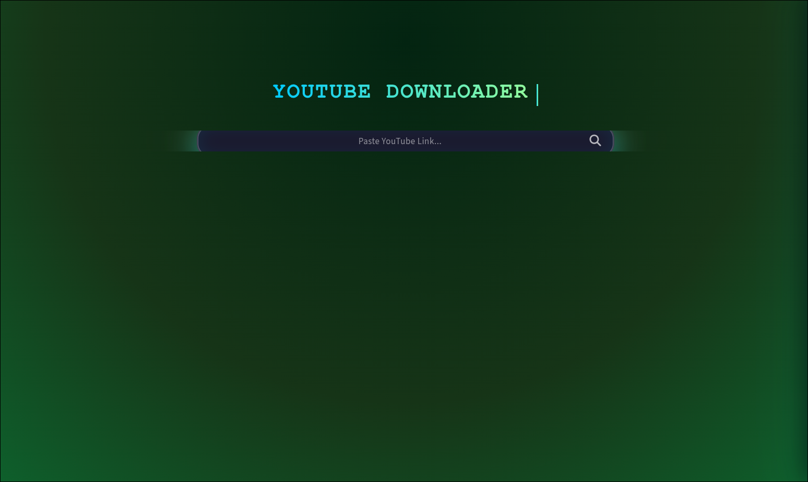

# 🎬 YT-Content-Downloader


A robust, full-stack web application for downloading YouTube content as high-quality **Video (MP4)** or **Audio (MP3)**.

The app uses a microservices architecture: a **Streamlit** frontend for the UI and a **Flask** backend for asynchronous processing using `yt-dlp`.

---

## 🖼️ Application Preview



---

## ✨ Features

- **🎥 Dual Mode**: Download high-res Video (`.mp4`) or extract Audio (`.mp3`).
- **⚡ Async Processing**: The UI never freezes because downloads run in a background API.
- **📊 Real-Time Status**: Live progress bars and speed indicators.
- **📂 File Library**: Browse, play, and delete downloaded files directly in the app.
- **🐳 Dockerized**: One-command deployment.

---

## 🛠️ Architecture & How It Works

This application separates the User Interface from the Heavy Processing to ensure performance.

```mermaid
graph TD
    User([User]) -->|1. Enters URL| Frontend[Streamlit Frontend <br> Port 4477]
    Frontend -->|2. POST Request| Backend[Flask API <br> Port 5000]
    Backend -->|3. Spawns| YTDLP[yt-dlp Process]
    YTDLP -->|4. Downloads from| YouTube[YouTube Servers]
    YTDLP -->|5. Saves to| Volume[Shared Docker Volume]
    Volume -.->|6. File Available| Frontend
    Frontend -->|7. User Downloads| User
